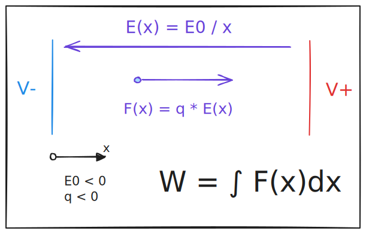

# Integraal Examples

We provide two examples of numerical integration: one computing from an analytical expression, and the other from
empirical data.

## Analytical problem

In this example we compute the work exerted by the Lorentz force over a charged particle in an electric field.

## Empirical problem

The data is a courtesy of @benncs.

In this example, we compute the average speed of a fluid at a given section of a pipe. Because the speed isn't
uniform over a section, we need to compute an average using integration and samples at different positions of
the section.
