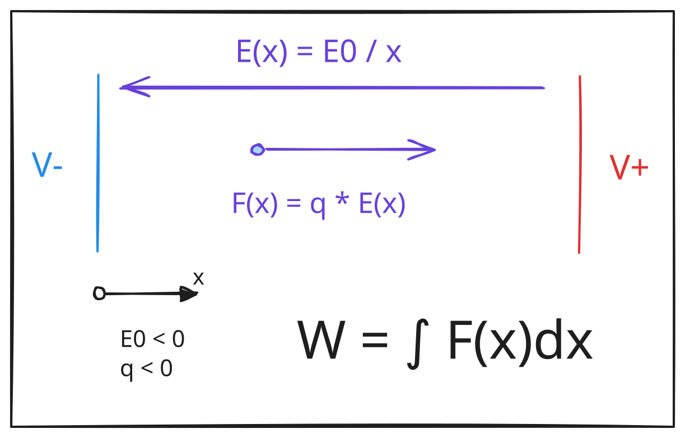
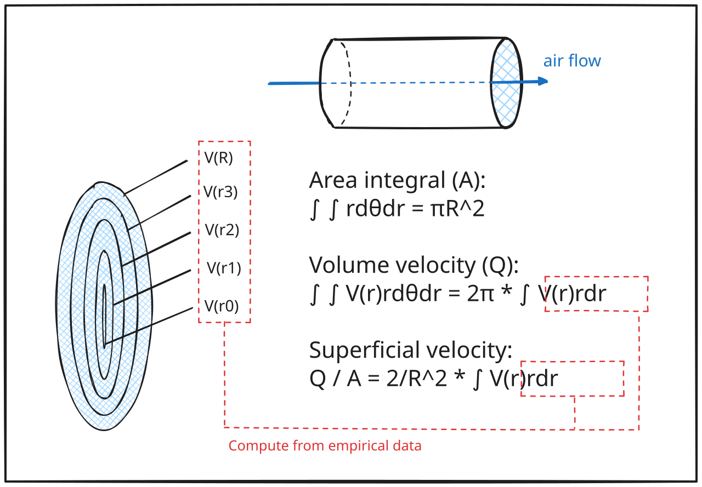

# Integraal Examples

We provide two examples of numerical integration: one computing from an analytical expression, and the other from
empirical data.

## Analytical problem

In this example we compute the work exerted by the Lorentz force over a charged particle in an electric field.



The expression of the integral is very easily obtained, and we can solve it with pen and paper to compare our
results. Run the example with the following command:

```sh
cargo run --example from_expression
```

## Empirical problem

The data is a courtesy of @benncs.

In this example, we compute the superficial velocity of a fluid at a given section of a pipe.



Because the velocity isn't uniform over a section, we need to compute an average using integration and samples at
different positions of the section. Run the example with the following command:

```sh
cargo run --example from_expression
```

